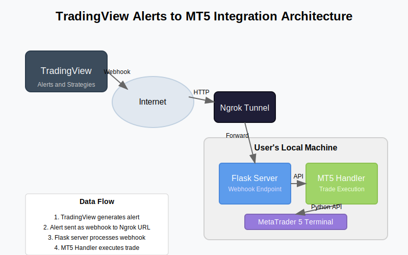

# TradingView Alerts to MT5 Integration

This project enables automated trading by connecting TradingView alerts to MetaTrader 5. It creates a local web server that receives webhook notifications from TradingView and executes trades in MT5 based on the parameters provided in the alert.

## Architecture



## Key Features

- **Webhook Server**: Receives trading signals from TradingView
- **MT5 Integration**: Executes trades directly in your MetaTrader 5 platform
- **Symbol Suffix Support**: Handles broker-specific symbol naming conventions
- **Position Management**: View and close positions through API endpoints
- **Secure Tunneling**: Makes your local server accessible to TradingView using Ngrok

## Requirements

- Python 3.11
- MetaTrader 5 platform installed
- TradingView account (Pro or Premium for webhook alerts)
- Ngrok account (free tier is sufficient) for creating the webhook tunnel https://ngrok.com/
- Postman for troubleshooting and API testing (optional)

## Project Structure

```
tradingview-alerts-to-metatrader5/
│
├── app/                           # Main application package
│   ├── __init__.py                # Package initialization
│   ├── config.py                  # Configuration from .env
│   ├── mt5_handler.py             # MT5 connection and trading logic
│   ├── server.py                  # Flask server for webhooks
│   └── utils.py                   # Utility functions
│
├── docs/                          # Documentation files
│   ├── images/                    # Image assets
│   └── README.md                  # Project documentation
│
├── postman/                       # Postman collection for API testing
│   ├── README.md                  # Postman setup instructions
│   └── postman_collection.json    # Postman collection
│
├── scripts/                       # Helper scripts
│   ├── ngrok_setup.py             # Script to setup and run Ngrok
│   ├── run_server_only.py         # Run Flask server without Ngrok
│   ├── run_ngrok_only.py          # Run Ngrok without Flask server
│   └── test_mt5_connection.py     # Test MT5 connection
│
├── .env.example                   # Example environment variables
├── .gitignore                     # Git ignore file
├── main.py                        # Main entry point
├── README.md                      # This documentation
└── requirements.txt               # Project dependencies
```

## Installation

1. **Clone the repository**:

   ```bash
   git clone https://github.com/abhidp/tradingview-alerts-to-metatrader5.git
   cd tradingview-alerts-to-metatrader5
   ```

2. **Create a virtual environment**:

   ```bash
   python -m venv venv
   source venv/bin/activate  # On Windows: venv\Scripts\activate
   ```

3. **Install dependencies**:

   ```bash
   pip install -r requirements.txt
   ```

4. **Configure environment variables**:
   ```bash
   cp .env.example .env
   ```
5. **Edit the `.env` file** with your MT5 account details and broker settings:

   ```
   # MT5 Configuration
   MT5_ACCOUNT=12345678
   MT5_PASSWORD=your-password
   MT5_SERVER=your-broker-server
   MT5_PATH=C:\Program Files\MetaTrader 5\terminal64.exe

   # MT5 Symbol Settings
   MT5_DEFAULT_SUFFIX=.r

   # Trading Parameters
   DEFAULT_VOLUME=0.01
   DEFAULT_STOP_LOSS=100
   DEFAULT_TAKE_PROFIT=200
   ```

## Getting Started

### 1. Test MT5 Connection

First, verify that your MT5 connection is working:

```bash
python main.py --test-mt5
```

This will verify that your credentials are correct and that you can connect to MT5.

### 2. Start the Application

The application has two main components:

- Flask server https://pypi.org/project/Flask/
- Ngrok tunneling service https://ngrok.com/

you can run the components separately in two different terminals.

**Start the Flask server:**

```bash
python scripts/run_server.py
```

**Start the Ngrok tunnel:**

```bash
python scripts/run_ngrok.py
```

after starting the ngrok tunnel you will get a public URL that you can use in trading view alerts.

once the ngrok tunnel is started, the Public Webook URL will be saved in `webhook_url.txt` file.

## Setting Up TradingView Alerts

1. **Create an alert in TradingView**:

   - Set up your indicator or strategy
   - Click "Create Alert"
   - Configure your alert conditions

2. **Configure the webhook**:

   - In the "Webhook URL" field, paste the Ngrok URL from `webhook_url.txt` (it will look like `https://xxxx.ngrok-free.app/trade`)

3. **Format your alert message as JSON**:

   ```json
   {
     "symbol": "EURUSD",
     "side": "{{strategy.order.action}}",
     "price": {{close}},
     "volume": 0.01,
     "stop_loss": 100,
     "take_profit": 200,
     "comment": "TradingView Signal"
   }
   ```

   Note that you don't need to add the broker-specific suffix (e.g., ".r") to the symbol. The application will add it automatically based on your MT5_DEFAULT_SUFFIX setting.

## Available API Endpoints

The application provides several HTTP endpoints:

- `GET /`: Root endpoint with basic information
- `POST /trade`: Main endpoint for receiving TradingView alerts
- `GET /health`: Health check endpoint to verify the server is running
- `GET /positions`: List all open positions
- `POST /position/<id>/close`: Close a specific position
- `GET /symbols`: List all available symbols in MT5
- `GET /symbols?q=EUR`: Search for symbols containing "EUR"

## Symbol Suffix Support

Many brokers use custom suffixes for their symbols (e.g., "EURUSD.r" instead of "EURUSD"). This application handles this automatically:

1. **In TradingView**: Use standard symbols without the suffix (e.g., "EURUSD")
2. **In MT5**: The application adds the configured suffix (e.g., "EURUSD.r")

Configure this in your `.env` file:

```
MT5_DEFAULT_SUFFIX=.r
```

## Troubleshooting

### Common Issues

1. **"No module named 'MetaTrader5'"**:

   - Make sure you've installed all dependencies: `pip install -r requirements.txt`

2. **MT5 connection errors**:

   - Verify your MT5 account details in the `.env` file
   - Ensure MT5 is running and logged in
   - Check the MT5 terminal for any error messages

3. **Symbol not found errors**:

   - Check the exact symbol format your broker uses
   - Verify the symbol suffix in your `.env` file
   - Use the `/symbols` endpoint to see all available symbols

4. **Ngrok errors**:
   - Make sure you have an internet connection
   - Check if another Ngrok process is already running

### Debugging Tips

- Check the log files in the `logs` directory for detailed error messages
- Use the `/health` endpoint to check if the server is running correctly
- Try the components separately to isolate issues

## Testing with Postman

The project includes a Postman collection for testing all API endpoints. This is helpful for debugging and validating the functionality without using TradingView.

### Postman Setup for Troubleshooting and Testing

Follow the instructions in [Postman README](postman/README.md) for detailed testing steps
and documentation on all endpoints

This allows you to:

- Test connectivity to your server
- Execute trades manually
- View and manage positions
- Search for available symbols
- Verify webhook functionality

## Production Considerations

For a more robust setup:

1. **Use a VPS**:

   - Run the application on a Virtual Private Server for 24/7 operation
   - This ensures your application keeps running even when your computer is off

2. **Replace Ngrok with a proper server**:

   - Register a domain name
   - Use a reverse proxy (Nginx, Apache) with SSL certificates
   - Configure proper port forwarding

3. **Add authentication**:
   - Implement API key authentication for your webhook
   - This prevents unauthorized access to your trading system

## License

This project is licensed under the MIT License - see the LICENSE file for details.

## Acknowledgements

- [MetaTrader5 Python Library](https://pypi.org/project/MetaTrader5/)
- [Flask](https://flask.palletsprojects.com/)
- [Ngrok](https://ngrok.com/)
